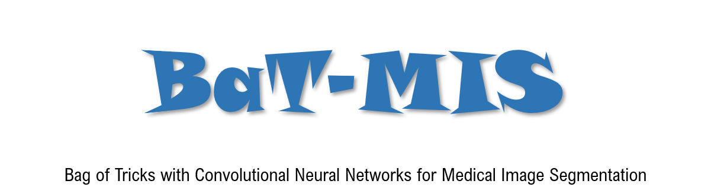
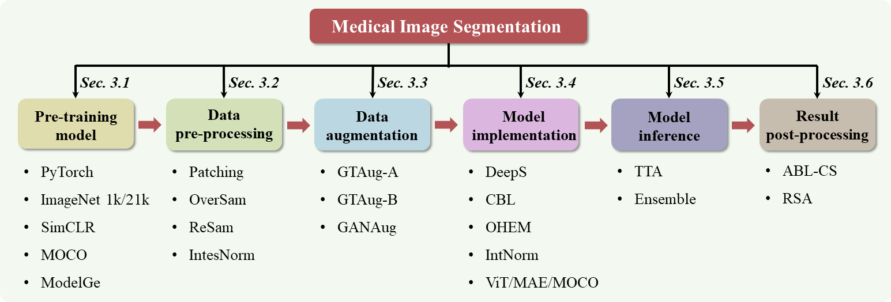

[comment]: <> ()


<div align="center">

[🆕News](#News) |
[🛠️Installation](#Installation) |
[👀Model Zoo](#Model-Zoo) |
[🤔Reporting Issues](https://github.com/hust-linyi/seg_trick/issues)

</div>


🌻 This is an official implementation for paper [MedISeg](https://arxiv.org/abs/2209.10307)

🌻 Here is a brief introduction on [知乎](https://zhuanlan.zhihu.com/p/566993442) 


## Introduction
<div align="justify">
Over the past few years, the rapid development of deep learning technologies for computer vision has significantly improved the performance of medical image segmentation (MedISeg). However, the diverse implementation strategies of various models have led to an extremely complex MedISeg system, resulting in a potential problem of unfair result comparisons. In this paper, we collect a series of MedISeg tricks for different model implementation phases (i.e., pre-training model, data pre-processing, data augmentation, model implementation, model inference, and result post-processing), and experimentally explore the effectiveness of these tricks on consistent baselines. With the extensive experimental results on both the representative 2D and 3D medical image datasets, we explicitly clarify the effect of these tricks. Moreover, based on the surveyed tricks, we also open-sourced a strong MedISeg repository, where each component has the advantage of plug-and-play. We believe that this milestone work not only completes a comprehensive and complementary survey of the state-of-the-art MedISeg approaches, but also offers a practical guide for addressing the future medical image processing challenges including but not limited to small dataset, class imbalance learning, multi-modality learning, and domain adaptation.
</div>

[comment]: <> ()

<div align="center">
The surveyed medical image segmentation tricks and their latent relations 
</div>

## Citation
🌻 If you use this toolbox or benchmark in your research, please cite:
```
@article{zhang2022deep,
  title={Understanding the Tricks of Deep Learning in Medical Image Segmentation: Challenges and Future Directions},
  author={Zhang, Dong and Lin, Yi and Chen, Hao and Tian, Zhuotao and Yang, Xin and Tang, Jinhui and Cheng, Kwang Ting},
  journal={arXiv},
  year={2022}
}
```

## News
🌻 1.1.1 was released in 01/05/2023   
🌻 1.1.0 was released in 01/09/2022

- **Supported Backbones:**
- [x] [ResNet (CVPR'2016)](https://arxiv.org/abs/1512.03385?context=cs)
- [x] [DenseNet (CVPR'2017)](https://arxiv.org/abs/1608.06993)
- [x] [ViT (ICLR'2021)](https://arxiv.org/abs/2010.11929)

- **Supported Methods:**
- [x] [2D-UNet (MICCAI'2015)](https://arxiv.org/abs/1505.04597)
- [x] [3D-UNet (MICCAI'2016)](https://arxiv.org/abs/1606.06650)

- **Supported Datasets:**
- [x] [ISIC 2018](https://challenge.isic-archive.com/landing/2018/) 
- [x] [CoNIC](https://conic-challenge.grand-challenge.org/)
- [x] [KiTS19](https://kits19.grand-challenge.org/data/)
- [x] [LiTS](https://competitions.codalab.org/competitions/17094)

## Installation
- **Option 1:**
```
pip install -r requirements.txt
```
- **Option 2:** 
```
pip install albumentations
pip install ml_collections
pip install numpy 
pip install opencv-python
pip install pandas
pip install rich
pip install SimpleITK
pip install timm
pip install torch
pip install tqdm
pip install nibabel
pip install medpy
```

## Data Preparation
Please download datasets from the official website:
- [x] ISIC 2018: [2D ISIC 2018 Lesion Boundary Segmentation Dataset](https://challenge.isic-archive.com/landing/2018/)
- [x] CoNIC: [2D Colon Nuclei Identification and Counting Challenge Dataset](https://conic-challenge.grand-challenge.org/)
- [x] KiTS19: [3D Kidney Tumor Segmentation 2019 Dataset](https://kits19.grand-challenge.org/data/)
- [x] LiTS17: [3D Liver Tumor Segmentation 2017 Dataset](https://www.kaggle.com/datasets/andrewmvd/liver-tumor-segmentation)

The data preparation code is provided in 
```
*/NetworkTrainer/dataloaders/data_prepare.py
``` 
for both 2D and 3D datasets.

## Inference with Pre-trained Models
Download the trained weights from [Model Zoo](#Model-Zoo). 

Run the following command for 2DUNet:
```
python unet2d/NetworkTrainer/test.py --test-model-path $YOUR_MODEL_PATH
```

Run the following command for 3DUNet:
```
python unet3d/NetworkTrainer/test.py --test-model-path $YOUR_MODEL_PATH
```

## Training & Evaluation
We provide the shell scripts for training and evaluation by 5-fold cross-validation. 

Run the following command for 2DUNet:
```
sh unet2d/config/baseline.sh
```

Run the following command for 3DUNet:
```
sh unet3d/config/baseline.sh
```
And the commands train/test with various tricks are also provided in  */config/. For the details of the segmentation tricks, please refer to the paper.

## Visualization
From top to bottom: raw image, ground truth, prediction.

[comment]: <> ()

<div align="center">
ISIC 2018 
</div>

[comment]: <> ()

<div align="center">
CoNIC
</div>

[comment]: <> ()

<div align="center">
KiTS19
</div>

[comment]: <> ()

<div align="center">
LiTS17
</div>

## Model Zoo

- Since our Google space is limited, here we only provide a part of the weight links. 

- In each cross-validation, here we only release a weight with a higher performance.

- The full weights can be downloaded from [Baidu Netdisk](https://pan.baidu.com/s/16YAZrN1lY0JmTMkJjLUwbQ?pwd=bi33).

Training weights on ISIC 2018:

Dataset  | Baseline | Method | Recall (%) | Percision (%) |  Dice (%) |  IoU (%) | Weight
------------- | ------------- | ------------- | ------------- | ------------- | ------------- | ------------- | -------------
[ISIC 2018](https://challenge.isic-archive.com/landing/2018/)  | 2DUNet | PyTorch | 88.37% |  91.41% |  88.17% |  86.66% | [weight](https://drive.google.com/drive/folders/1IdWfJG2xC_OiVxSFlwEZBdQuFAMWKilW?usp=sharing)
[ISIC 2018](https://challenge.isic-archive.com/landing/2018/)  | 2DUNet | + Image-21K | 90.06% |  92.64% |  90.07% |  88.44% | [weight](https://drive.google.com/drive/folders/1yrNhgoEWLCC--vrQpmwvFOfe_jq4qc59?usp=sharing) 
[ISIC 2018](https://challenge.isic-archive.com/landing/2018/)  | 2DUNet | + GTAug-B | 88.46% |  93.22% |  89.19% |  87.68% | [weight](https://drive.google.com/drive/folders/1WQxMGWl4shCvMxqBPc8kbr5Vry7Z20ba?usp=sharing)
[ISIC 2018](https://challenge.isic-archive.com/landing/2018/)  | 2DUNet | + CBL(Tvers) | 89.93% | 90.47% |  88.53% |  86.72% | [weight](https://drive.google.com/drive/folders/1WQxMGWl4shCvMxqBPc8kbr5Vry7Z20ba?usp=sharing) 
[ISIC 2018](https://challenge.isic-archive.com/landing/2018/)  | 2DUNet | + TTAGTAug-B | 89.74% | 92.40% |  89.61% |  88.14% | -
[ISIC 2018](https://challenge.isic-archive.com/landing/2018/)  | 2DUNet | + EnsAvg | 90.80% | 90.88% |  89.32% |  87.72% | [weight](https://drive.google.com/drive/folders/1WQxMGWl4shCvMxqBPc8kbr5Vry7Z20ba?usp=sharing)


Training weights on CoNIC:

Dataset  | Baseline | Method | Recall (%) | Percision (%) |  Dice (%) |  IoU (%) | Weight
------------- | ------------- | ------------- | ------------- | ------------- | ------------- | ------------- | -------------
[CoNIC](https://conic-challenge.grand-challenge.org/)  | 2DUNet | PyTorch | 77.76% |  74.71% |  75.76% |  77.17% | [weight](https://drive.google.com/drive/folders/1bbezwI6GPvncD74SrWTYFkNsc2qXHQu7?usp=sharing)
[CoNIC](https://conic-challenge.grand-challenge.org/)  | 2DUNet | + Image-21K | 80.59% |  76.71% |  78.25% |  79.14% | [weight](https://drive.google.com/drive/folders/1M7wxlR6Hq1T61CMYu4pZYauUwOFXc2iN?usp=sharing)
[CoNIC](https://conic-challenge.grand-challenge.org/)  | 2DUNet | + GTAug-B | 81.23% |  80.57% |  80.53% |  81.02% | [weight](https://drive.google.com/drive/folders/1BndVGRwz-QHYlrXuCY-t9l3zYoDgHdNM?usp=sharing)
[CoNIC](https://conic-challenge.grand-challenge.org/)  | 2DUNet | + TTAGTAug-A | 80.22% | 79.29% |  79.28% |  79.98% | -


Training weights on KiTS19:

Dataset  | Baseline | Method | Recall (%) | Percision (%) |  Dice (%) |  IoU (%) | Weight
------------- | ------------- | ------------- | ------------- | ------------- | ------------- | ------------- | -------------
[KiTS19](https://kits19.grand-challenge.org/data/) | 3DUNet | PyTorch  | 93.69% | 95.28% |  94.32% |  89.44% | [weight](https://drive.google.com/drive/folders/1JjdN0peTGWAWjbjKRUvkGreakdykzlmU?usp=sharing)
[KiTS19](https://kits19.grand-challenge.org/data/) | 3DUNet | + EnsAvg  | 94.46% |  96.29% |  95.27% |  91.09% | [weight](https://drive.google.com/drive/folders/1lgmcqNzGZDJgcz44pLQ318sz7b2Hl1LS?usp=sharing)

Training weights on LiTS17:

Dataset  | Baseline | Method | Recall (%) | Percision (%) |  Dice (%) |  IoU (%) | Weight
------------- | ------------- | ------------- | ------------- | ------------- | ------------- | ------------- | -------------
[LiTS17](https://www.kaggle.com/datasets/andrewmvd/liver-tumor-segmentation) | 3DUNet | PyTorch  | 93.66% | 82.08% |  87.00% |  77.37% | [weight](https://drive.google.com/drive/folders/1vgPJX4ISO-N8qi2y9RrwJHW3_hGGMYfR?usp=sharing)
[LiTS17](https://www.kaggle.com/datasets/andrewmvd/liver-tumor-segmentation) | 3DUNet | + ModelGe  | 92.98% | 80.80% |  85.89% |  75.63% | [weight](https://drive.google.com/drive/folders/1dapMlJDTRZgsRtXkPqWJzs83YVUlDpLE?usp=sharing)
[LiTS17](https://www.kaggle.com/datasets/andrewmvd/liver-tumor-segmentation) | 3DUNet | Patching192  | 95.33% | 94.67% |  94.87% |  90.40% | [weight](https://drive.google.com/drive/folders/1iqCeI9YIW7-UA2i3P93hiBGo2I8nN9N5?usp=sharing)
[LiTS17](https://www.kaggle.com/datasets/andrewmvd/liver-tumor-segmentation) | 3DUNet | + GTAug-A  | 92.08% | 73.40% |  81.15% |  68.71% | [weight](https://drive.google.com/drive/folders/1fyT4l04mZ3I9ADm9A38tDw_fUVa3LJX-?usp=sharing)
[LiTS17](https://www.kaggle.com/datasets/andrewmvd/liver-tumor-segmentation) | 3DUNet | + OHEM  | 92.50% |  82.78% |  86.81% |  77.12% | [weight](https://drive.google.com/drive/folders/1gR_y_7nVzm0vUAXavlSUrzTnu3R2DLXF?usp=sharing)
[LiTS17](https://www.kaggle.com/datasets/andrewmvd/liver-tumor-segmentation) | 3DUNet | + EnsAvg  | 92.10% |  87.21% |  89.07% |  80.70% | [weight](https://drive.google.com/drive/folders/1nLWZ3EcqIGpe9KFhHKBPld4Jn6O7YDrv?usp=sharing)
[LiTS17](https://www.kaggle.com/datasets/andrewmvd/liver-tumor-segmentation) | 3DUNet | + ABL-CS  | 93.65% |  84.97% |  88.60% |  80.01% | -


## Todo list
- [ ] Experiments on more datasets 

- [ ] Experiments on other backbones 

- [ ] Experiments on more tricks

- [ ] Other interesting attempts


## Announcements
🌻 Some codes are borrowed from [nnUNet](https://github.com/MIC-DKFZ/nnUNet) and [TransUNet](https://github.com/Beckschen/TransUNet), thanks for their great work.

🌻 We welcome more like-minded friends to join in this project and continue to expand this storage

🌻 If you have any suggestions or comments please let us know

🌻 If you have any problems in using this code, please contact: yi.lin@connect.ust.hk or dongz@ust.hk